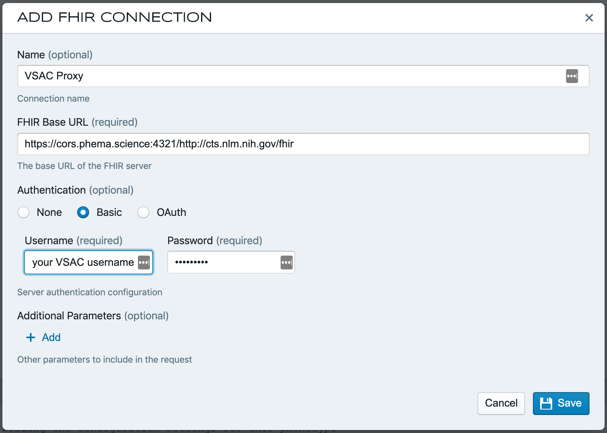

# Contributing

This documents describes the steps necessary to translate a PheKB phenotype into
a FHIR-native representation, using CQL as the logical expression language.

## Overall Process

The over process to translate a phenotype is:

1. Select an untranslated phenotype from the [data](../data) directory. See the list on the [main readme](../readme.md) for a list of phenotypes and their status.
2. Create any necessary value sets as FHIR <kbd>ValueSet</kbd> resources, and add them to the cache.
3. Translate phenotype logic into CQL.
4. Create tests.

## Prerequisites

#### NodeJS

The testing framework uses the JavaScript CQL engine, so you need NodeJS
installed to create tests. The installer can be found
[here](https://nodejs.org/en/download/). The tests are currently being run on
Travis using NodeJS version `11.14.0`.

#### Java

The testing framework operates on ELM, not CQL, so we use the reference
implementation of the CQL to ELM translator to convert our CQL to ELM before
running the tests. Travis runs the CQL to ELM conversion using OpenJDK 11,
which can be found [here](https://jdk.java.net/java-se-ri/11).

#### Dependencies

Clone the repo:

```
git clone https://github.com/PheMA/phema-workbench-repository.git && cd phema-workbench-repository
```

Install yarn globally:

```
npm install -g yarn
```

Install the JavaScript dependencies:

```
yarn install
```

#### Editor

Two good editors to use for writing CQL are [Atom](https://atom.io/) and [VSCode](https://code.visualstudio.com/).

If you use Atom, install the [CQL language
plugin](https://atom.io/packages/language-cql). This will give you syntax
highlighting and some feedback on syntax errors. This plugin also includes a way
to execute CQL, but the mechanism is different from the testing framework we
use, so execution will not succeed without some extra work not described here.

If you use VSCode, install the [Clinical Quality
Language](https://marketplace.visualstudio.com/items?itemName=jonnokc.clinical-quality-language)
plugin to get syntax highlighting.

#### Operating System

The process has currently only been tested on macOS. The overall process should
work on Windows too, but we will likely need to add Windows-specific scripts to
the [`package.json` file](../package.json).

## Directory Structure

All phenotypes are in the [`phenotypes`](../phenotypes) directory. The directories
are named using the PheKB ID and slug. There are three directories inside each
directory: `cql`, `test`, and `valuesets`.

There is a `yarn` script to scaffold the directory structure as well as the CQL
and test files. The script is run as follows:

```
yarn scaffold 123.phenotype-slug
```

Note that the parameter must use the format `/[0-9]*\.[a-z\-]*`.

## Value Sets

Value sets are an important part of any phenotype definition. To support
FHIR-native execution, we create value sets as FHIR <kbd>ValueSet</kbd>
resources.

### Creation

The Terminology Manager application in the [PhEMA
Workbench](https://workbench.phema.science:4321/) can be used to create these
resources. This tool currently supports searching VSAC, uploading FHIR
<kbd>ValueSet</kbd> resources directly, as well as importing concept sets
exported from OHDSI Atlas.

#### Searching VSAC

To search VSAC, configure a new FHIR connection in Workbench as follows:

<p align="center">
    
</p>

You must use exactly the following URL:

> https://cors.phema.science:4321/http://cts.nlm.nih.gov/fhir

This is because VSAC is not properly configured for
[CORS](https://developer.mozilla.org/en-US/docs/Web/HTTP/CORS), which means that
we have to proxy requests via our backend. Use the username <kbd>apikey</kbd> and your
API KEY (found [here](https://uts.nlm.nih.gov/uts/profile)) as the password. These credentials are only stored in your browser, so there is very
limited security risk.

#### Uploading FHIR Resources

You can upload FHIR <kbd>ValueSet</kbd> resources as well as <kbd>Bundle</kbd>
resources directly into the Terminology Manager application.

#### OHDSI Atlas Concept Map Import

Atlas allows exporting of concept sets. This is done by clicking the `Export`
tab on the [Concept Sets](http://52.162.236.199/atlas/#/conceptsets) page.
Simply click to select one or more concept sets, and then click the <kbd>Export
Concept Sets</kbd> button. This will create a file called
`exportedConceptSets.zip`. Upload this file in the PhEMA Terminology Manager
application and these concept sets will be converted to FHIR <kbd>ValueSet</kbd>
resources.

:bulb: It is recommended that you have the `VSAC Proxy` connection selected as
the `Source` when uploading the exported Atlas concept set. This will ensure
that any standard code systems are also added to the terminology bundle.

#### OMOP Database Search

There is a [script](../scripts/valueset-builder.js) that can create a `Bundle` of FHIR `ValueSet` resources by
taking a single CSV file as input, and directly searching the OMOP database. An
example of such a CSV file is:

| valueSetId                                    | valueSetName                            | searchTerm        | vocabularyId |
| --------------------------------------------- | --------------------------------------- | ----------------- | ------------ |
| 17.R1.anemias-and-other-hematologic-disorders | Anemias and Other Hematologic Disorders | 281.3             | ICD9CM       |
| 17.R1.anemias-and-other-hematologic-disorders | Anemias and Other Hematologic Disorders | 281.4             | ICD9CM       |
| 17.R1.anemias-and-other-hematologic-disorders | Anemias and Other Hematologic Disorders | 281.9             | ICD9CM       |
| 17.IV.hereditary-anemias                      | Hereditary Anemias                      | 282.64            | ICD9CM       |
| 17.IV.hereditary-anemias                      | Hereditary Anemias                      | ^200.\*           | ICD9CM       |
| 17.red-blood-cell-meds                        | Medications Affecting Growth            | aminoglutethimide | RxNorm       |

Note the following things:

- The number and names of the columns must match _exactly_
- Search terms containing <kbd>^</kbd> or <kbd>\*</kbd> will be matched as Regular Expressions
- If the **vocabularyId** field is `RxNorm` (case sensitive), the search term
  will be matched (case _insensitive_) against the RxNorm concept _name_, not
  the concept _code_ (like with the other terminologies)

The script extracts the database connection details from environment variables
(as described [here](https://node-postgres.com/features/connecting)). You also
need to specify the input CSV file path and Bundle output file paht using the
<kbd>-i</kbd> and <kbd>-o</kbd> command line arguments. For example:

```
PGHOST=65.52.10.157 PGUSER=ohdsi_admin_user PGPASSWORD=<password> PGDATABASE=ohdsi \
  scripts/valueset-builder.js \
  -i ./phenotypes/17.red-blood-cell-indices/valuesets/raw.csv \
  -o ./phenotypes/17.red-blood-cell-indices/valuesets/17.red-blood-cell-indices-valuesets.bundle.json
```

For a list of valid `vocabularyId` values, see [this
file](https://github.com/PheMA/phema-workbench-app/blob/3c3bb2e951702b62c9056a66dc95a6ccceac5253/packages/terminology-utils/src/transform/omopVocabularies.ts)
and the bottom of [the script](<[script](../scripts/valueset-builder.js)>). Use
the values found in the `omopVocabularyId` field. The case should match exactly
values in the script and only the entries with non-empty `fhirCanonicalUrl`
values are useful.

#### Medication Value Sets

~~There is [this script](https://github.com/PheMA/phema-workbench-repository/blob/973e7cbeea7cb4a6287746fd943555e131155227/scripts/create-medication-valueset.js) that will take a list of medications (just update the `SEARCH_STRINGS` array) and create a FHIR `ValueSet` resource by searching RxNav.~~

This script has been deprecated and replaced by the OMOP Database Search script
described above.

### Preparation

Once you have your value sets assembled in the Terminology Manager application,
you can download them by clicking on the <kbd>Download</kbd> button. This will
download a FHIR <kbd>Bundle</kbd> containing the assembled value sets and code
systems.

Right now you need to manually copy the <kbd>ValueSet</kbd> resources out of
this bundle and place them in the `valuesets` directory under your phenotype.
The is an open issue to support loading bundles directly (see
[#1](https://github.com/PheMA/phema-workbench-repository/issues/1)).

Finally, the testing framework used technically only supports loading value set
from VSAC. However, it caches these value sets on the file system, so we can
manually populate this cache with any value sets we want. The
[prepare-valueset-cache](../scripts/prepare-valueset-cache.js) script does exact
this. The script looks for all <kbd>ValueSet</kbd> resources present in the
`valuesets` directory of all phenotypes and parses them and adds them to the
[value set cache](../phenotypes/__common/.vscache/valueset-db.json).

The value set cache is updated using the following command:

```
yarn prep-vscache
```

Value sets used by many phenotypes should be added to
[\_\_common/valuesets](../phenotypes/__common/valuesets). `ValueSet` resources
in this location are also added to the cache when the above command is executed.

## CQL Logic

The current convention is to create a `cql` directory under your phenotype to
store any related CQL libraries. Libraries that are common to many phenotypes
should be placed in [\_\_common/cql](../phenotypes/__common/cql).

### Conventions

This is an evolving list of conventions that should expand greatly as we
translate more phenotypes.

#### Context

All libraries should be written in the patient context, and it should be up to
the executing engine to apply the library to all members of a population.

#### Library Names

Current we are using the PheKB ID and slug as the filename, but we should discuss
what makes sense long term.

:warning: **Importantly:** The CQL filename must match exactly the name used
in the `library` statement. For example, if the CQL file contains:

```python
library "97.abdominal-aortic-aneuryms-aaa" version '1.0.0'
```

Then the filename MUST be `97.abdominal-aortic-aneuryms-aaa.cql`. I believe that
`97.abdominal-aortic-aneuryms-aaa-1.0.0.cql` would also be acceptable.

#### Statement Names

Intermediate statements should have meaningful names, but are less important than
the statement which determines if a patient is a _case_ or not. This statement
should have the identifier `"Case"`. For example:

```js
// Determines if the patient is a case
define "Case":
    "Has Condition" and "Has Medication" and "Other Criteria"
```

:bulb: For now we are only characterizing cases, not controls or non-cases or
suspected cases.

#### Structured and Unstructured Data Considerations

We are focused on translating criteria from the original phenotype definition that can be represented using structured data as a FHIR resource. This allows us to ignore if it's actually feasibile that some type of structured data would be available within an EHR. For example, sites may not capture a patient's status in a biobank, but we are able to represent it using FHIR so we will use that within our CQL.

Another consideration is for natural language processing (NLP). We do not need to perform any NLP-specific logic within our CQL translation. For example, if a phenotype says to "look for the string 'hypertension' in the Family History section of all notes", we do not need to try and create CQL logic that tries to search through document text. However, we are able to take the intent of what was written in the original phenotype and we could represent this as "Family history of hypertension" in CQL.

This translation of NLP does not always need to be done. And this section will be updated for additional scenarios and guidance as we discover them. When in doubt, we will discuss as a group and come to a consensus.

### Patterns

See the [Patterns documentaiton](./Patterns.md) for some details on how phenotypes
should be modeled in CQL and FHIR.

## Tests

Tests are extremely important, and are currently the only way to know if the
CQL logic we write is correct, since we cannot currently execute our phenotypes
in production, and even if we could, we do not have access to gold standard
cohorts in every instance for comparison.

The testing framework we use is AHRQ's [CQL Testing
Framework](https://github.com/AHRQ-CDS/CQL-Testing-Framework) (CTF). This framework
integrates with [Mocha](https://mochajs.org/) and uses the [JavaScript CQL
engine](https://github.com/cqframework/cql-execution) to execute CQL logic. The
CTF additionally allows us to specify FHIR data using a special YAML
shorthand that makes creating data for tests very convenient.

### Caveats

While the CTF is very useful, there are two important caveats that we need to
work around.

#### Value Sets

The CTF uses [`cql-exec-vsac`](https://github.com/cqframework/cql-exec-vsac) as
its value set service, which means that only VSAC value sets are supported. The
idea is that the CQL author will configure their VSAC credentials, and upload
their value sets to VSAC, and the CTF will download from there.

While we could do this, it adds additional steps to phenotype development, so
we use a simple workaround instead. For optimization purposes, `cql-exec-vsac`
only ever downloads value set from VSAC once, and stores them in a cache. The
cache is just a JSON file containing the value set data in a custom format (see
an example [here](../phenotypes/__common/.vscache/valueset-db.json)).

To use local value sets, we have a
[script](../scripts/prepare-valueset-cache.js) that traverses the phenotype
directory and parses valuesets in the `valuesets` directory of each phenotype
(and in `__common\valuesets`) and adds them to the cache. This is done by
running:

```
yarn prep-vscache
```

Once this is done, the CTF will find our value set in the cache and will not try
to find it in VSAC.

#### ELM

The CTF can only operate on ELM, and so we must convert our CQL to ELM before
running the tests. For this reason we have included a compiled version of the
[`cql-to-elm`](https://github.com/cqframework/clinical_quality_language/tree/master/Src/java/cql-to-elm)
translator in the [tools](./tools) directory.

To convert your CQL to ELM run the following command:

```
yarn update-elm
```

It isn't actually necessary to do this manually, because this step is executed
automatically when you run `yarn test`.

### Configuration

Inside each phenotype directory there should be a `test` directory that contains
a file called `cqlt.yaml`. This is the main test configuration file for the
phenotype, and should look almost identical to this:

```yaml
---
library:
  name: "97.abdominal-aortic-aneuryms-aaa" # Only this needs to be updated you match your library/file name
  paths:
    - ../cql
    - ../../__common/cql
tests:
  path: cases
options:
  vsac:
    cache: ../../__common/.vscache # It is important to keep this fixed
  date: "2020-09-17T00:00:00.0Z"
  dumpFiles:
    enabled: false # Change this to true to generate debugging output
    path: ../../../debugging_output
```

Only the library name needs to be updated to match the library (and file) name
of your phenotype. The complete documentation for the `cqlt.yaml` file can be
found
[here](https://github.com/AHRQ-CDS/CQL-Testing-Framework#the-cqltyaml-file).

#### Cases

Any number of individual test cases can be written for a single phenotype. The
current convention is to put these in a `cases` directory inside the `test`
directory (this matches the `tests.path` key in the above yaml).

Test cases have three parts, a **name**, a **data** section, and a **results**
section. The **name** is just for display purposes, but the other sections are
described briefly here.

##### Generating New Cases

There is an `npm` script that can generate a new case for a phenotype and
automatically increase the number. The new case can either be copied from the
previous case (the default), or be created from a blank template. By default
the phenotype slug will be inferred from the name of the current git branch,
but it can also be manually specified with `-s`.

To create a new test case by copying the previous one, run:

```
yarn new-test
```

To manually specify the phenotype slug, run:

```
yarn new-test -s 112.herpes-zoster
```

To generate a case from a blank template, use `-c false`:

```
yarn new-test -c false
```

Both flags can be used simultaneously.

##### Data

The data section is used to specify FHIR resources that should be used when
running the test cases. This usually consists of a patient and associated
resources like `Condition` and/or `Procedure`. An example data section
could look like:

```yaml
data:
  - resourceType: Patient
    name: Joe Smith
    gender: male
    birthDate: 1958-07-16

  - resourceType: Procedure
    code: CPT#34802 Endovascular repair of infrarenal abdominal aortic aneurysm or dissection; using modular bifurcated prosthesis (1 docking limb)
    performedDateTime: "2008-11-12T16:00:00.000Z"
```

Note the special shorthand for creating data, described in detail [here](https://github.com/AHRQ-CDS/CQL-Testing-Framework/blob/master/CREATING-TEST-CASES.md#the-data-section).

It is also possible to reuse individual resources or sets of resources during
testing. See the [reusing resources
docs](https://github.com/AHRQ-CDS/CQL-Testing-Framework/blob/master/CREATING-TEST-CASES.md#reusing-resources)
for instructions on how to do that.

##### Results

The results section is simply a set of key value pairs that specify the name of
a CQL statement and the expected result given the data described above. An
example is:

```yaml
results:
  Has Exclusion Diagnosis: false
  AAA Repair Procedures: $should have length 2
  Case Type 1: true
```

Each line is a statement name, followed by a colon and the expected result. The
CTF provides a few special keyword like `$should`, which are described in [the
results section docs](https://github.com/AHRQ-CDS/CQL-Testing-Framework/blob/master/CREATING-TEST-CASES.md#the-results-section).

The complete documentation for create tests cases is [here](https://github.com/AHRQ-CDS/CQL-Testing-Framework/blob/master/CREATING-TEST-CASES.md).

### Execution

To actually run the tests, execute the following:

```
yarn test
```

The search path for tests is defined in [`test.js`](../test.js). By default
every test in the `phenotypes` directory will be run, but there is a comment in
that file that explains how to adjust the search path during development. This
can be done to only run the test you are currently working on to speed up test
development.

## Troubleshooting

There are a lot of moving parts in this repository, so issues are likely to
arise. This section should be updated to include any troubleshooting tips or
gotchas.

### 🐛 Debugging Output

The main `cqlt.yaml` file has an option `dumpFiles` key described
[here](https://github.com/AHRQ-CDS/CQL-Testing-Framework#the-cqltyaml-file).
This can be turned on to generate debugging output, which can be used to figure
out why your test cases might not be working.

### 📚 Includes

There are a few issues around included libraries. First, they are handled
differently by the `cql-to-elm` translator and the `cql-execution` engine used
by the CTF.

The translator needs all included libraries to be in the same directory as the
including library.

- [ ] TODO: Add a script that copies CQL/ELM from `__common/cql` to each
      phenotype that includes common libraries.

The `cql-execution` engine seems to not like quoted libraries names. So, it
is best to use library names like `Diabetes` and _NOT_ `"Diabetes"`.

:warning: **The latter issue manifests as a valueset resolution problem in the
part of the code that looks for referenced valuesets. Since the library is
`null`, `library.valuesets` causes the code to break, which makes this particular
gotcha hard to diagnose.**
